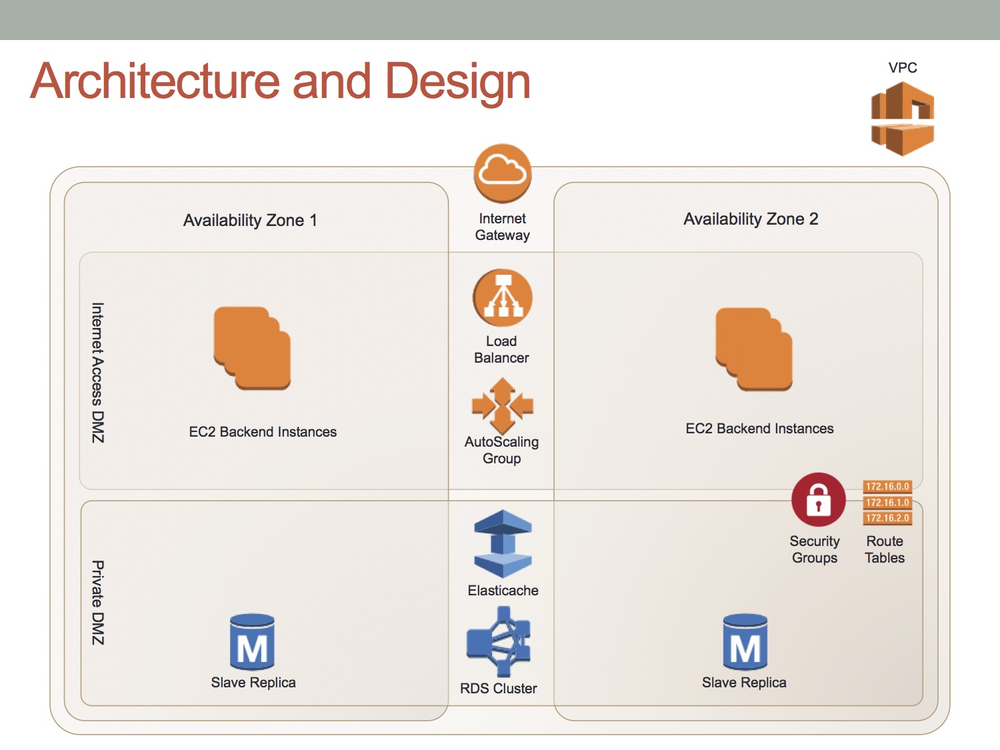

# CloudFormation myBB

## Goal

Using a single CloudFormation template file create a myBB forum with the following requirements

* VPC
* Multi AZ RDS database
* ElasticCache (memcached)
* Load Balancer
* Frontend Auto Scalling
* Isolated security groups

## Architecture Diagram

